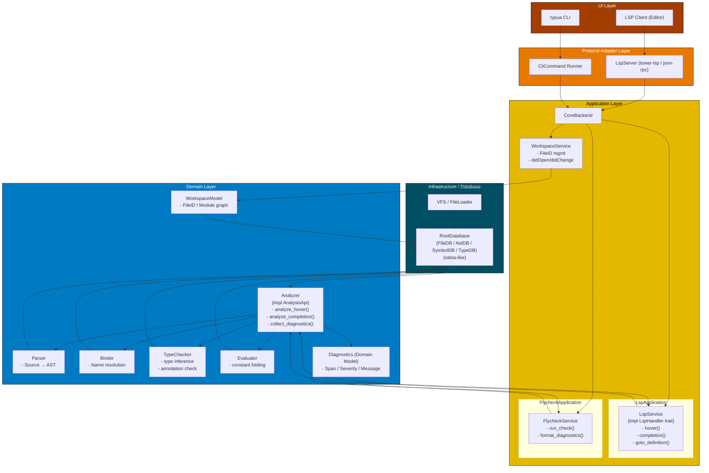

```mermaid
---
config:
  layout: tidy-tree
---
graph TB

%% ========================
%% Color palette variables
%% ========================
classDef ui fill:#A43D00,stroke:#000,stroke-width:1px,color:#fff;
classDef proto fill:#E87900,stroke:#000,stroke-width:1px,color:#fff;
classDef app fill:#E5B800,stroke:#000,stroke-width:1px,color:#000;
classDef domain fill:#007AC2,stroke:#000,stroke-width:1px,color:#fff;
classDef infra fill:#004F63,stroke:#000,stroke-width:1px,color:#fff;

%% ========================
%% UI Layer
%% ========================
subgraph UI["UI Layer"]
  editor["LSP Client (Editor)"]
  cli["typua CLI"]
end
class UI ui

%% ========================
%% Protocol Adapter Layer
%% ========================
subgraph PA["Protocol Adapter Layer"]
  lspServer["LspServer (tower-lsp / json-rpc)"]
  cliRunner["CliCommand Runner"]
end
class PA proto

%% ========================
%% Application Layer
%% ========================
subgraph APP["Application Layer"]
  coreBackend["CoreBackend"]

  subgraph LAPP["LspApplication"]
    lspService["LspService\n(impl LspHandler trait)\n- hover()\n- completion()\n- goto_definition()"]
  end

  subgraph FAPP["FlycheckApplication"]
    flyService["FlycheckService\n- run_check()\n- format_diagnostics()"]
  end

  wsService["WorkspaceService\n- FileID mgmt\n- didOpen/didChange"]
end
class APP app

%% ========================
%% Domain Layer
%% ========================
subgraph DOMAIN["Domain Layer"]
  analyzer["Analyzer\n(impl AnalysisApi)\n- analyze_hover()\n- analyze_completion()\n- collect_diagnostics()"]
  parser["Parser\n- Source → AST"]
  binder["Binder\n- Name resolution"]
  tychecker["TypeChecker\n- type inference\n- annotation check"]
  evaluator["Evaluator\n- constant folding"]
  diagModel["Diagnostics (Domain Model)\n- Span / Severity / Message"]
  workspaceModel["WorkspaceModel\n- FileID / Module graph"]
end
class DOMAIN domain

%% ========================
%% Infrastructure Layer
%% ========================
subgraph INFRA["Infrastructure / Database"]
  rootDb["RootDatabase\n(FileDB / AstDB / SymbolDB / TypeDB)\n(salsa-like)"]
  vfs["VFS / FileLoader"]
end
class INFRA infra


%% ===== Connections ======
editor --> lspServer
cli --> cliRunner

lspServer --> coreBackend
cliRunner --> coreBackend

coreBackend --> wsService
coreBackend --> lspService
coreBackend --> flyService

lspService --> analyzer
flyService --> analyzer
wsService --> workspaceModel

analyzer --> parser
analyzer --> binder
analyzer --> tychecker
analyzer --> evaluator

parser --> rootDb
binder --> rootDb
tychecker --> rootDb
evaluator --> rootDb
workspaceModel --> rootDb

rootDb --> analyzer
vfs --> rootDb

analyzer --> diagModel
diagModel --> lspService
diagModel --> flyService
```
