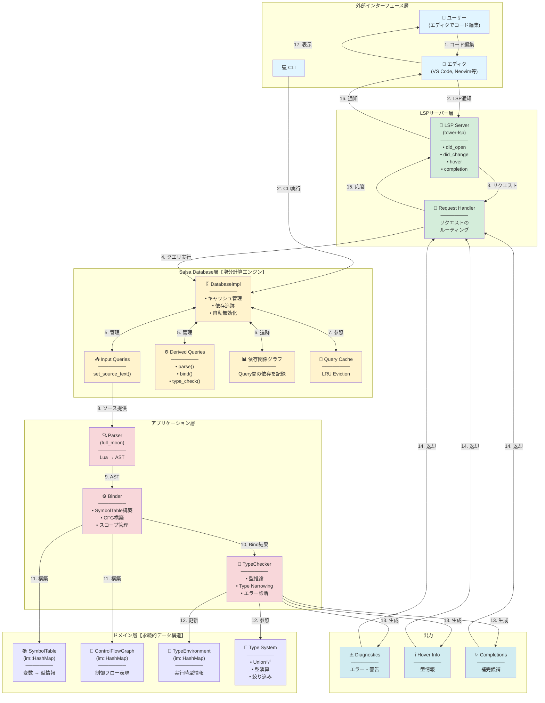
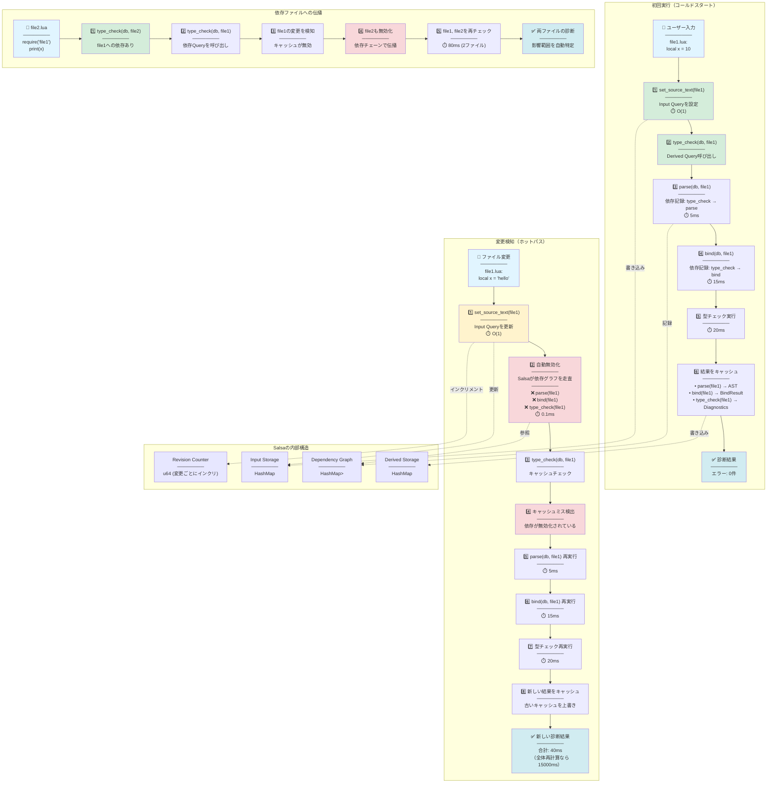
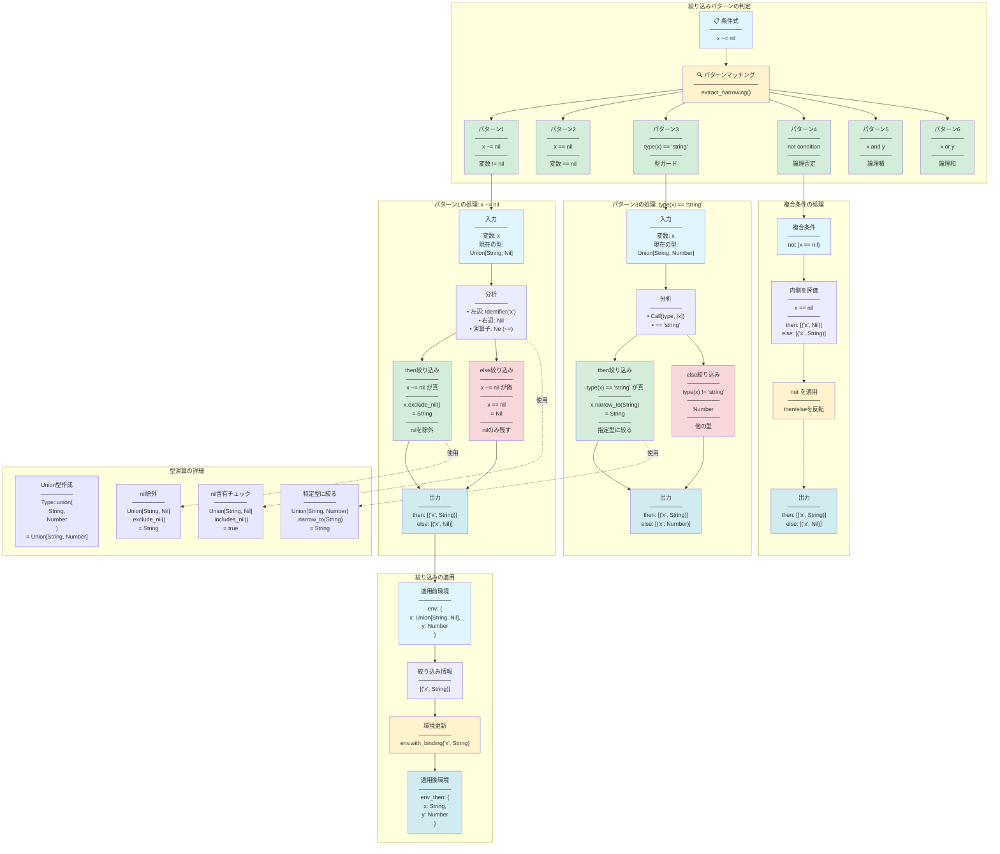
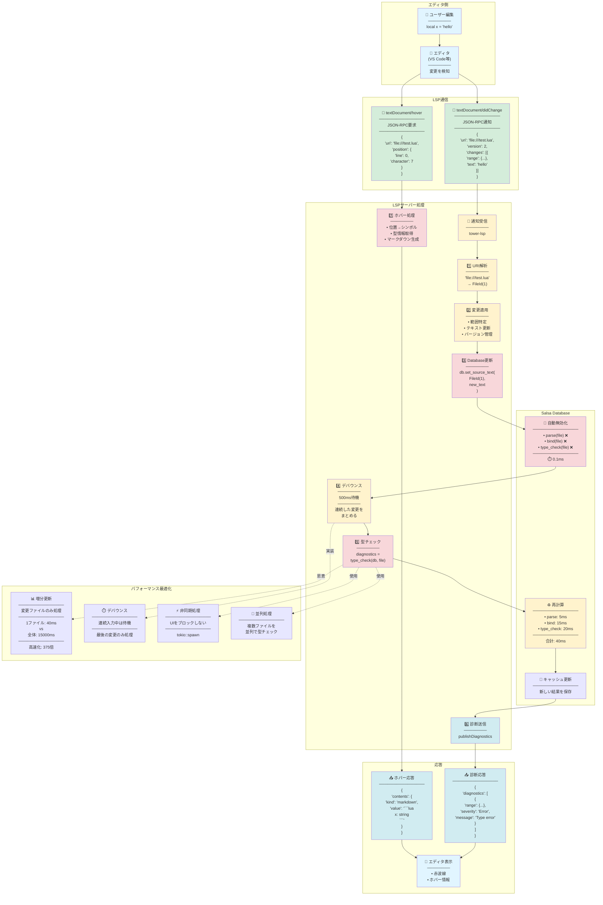
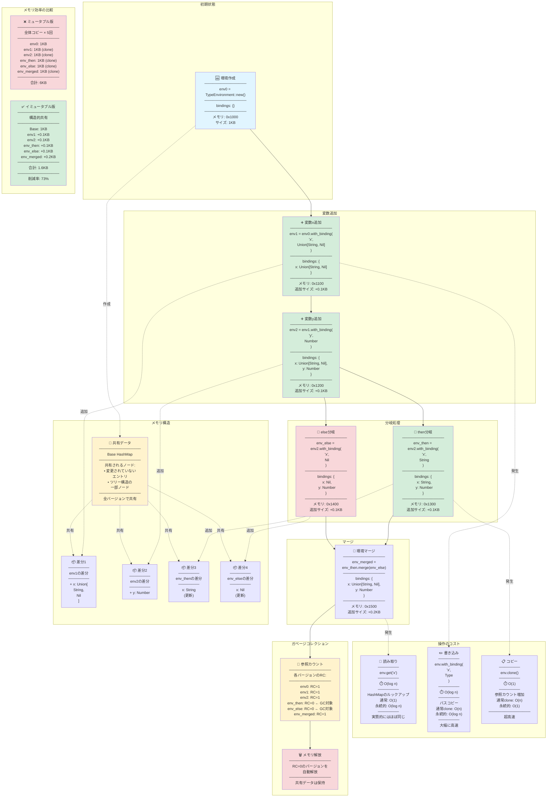
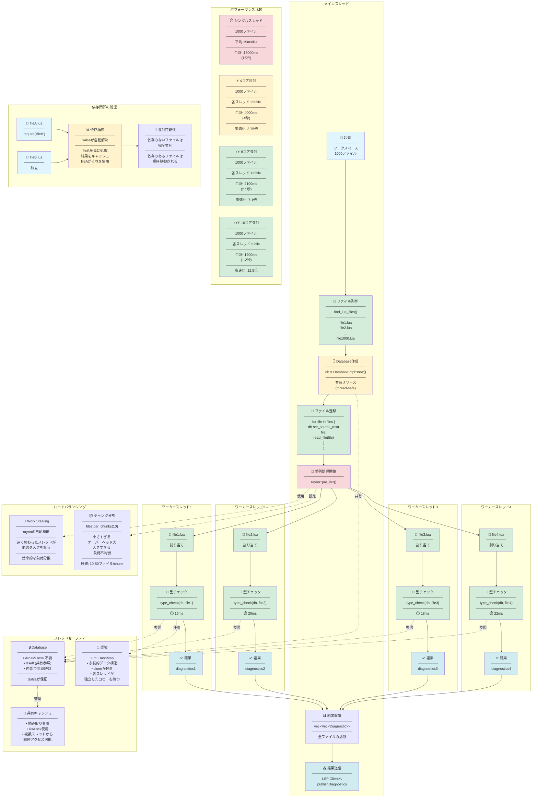

# Lua型検査機 - 詳細データフロー図

## 目次
1. [全体アーキテクチャとデータフロー](#1-全体アーキテクチャとデータフロー)
2. [Salsaベースの増分計算フロー](#2-salsaベースの増分計算フロー)
3. [型チェックの詳細フロー](#3-型チェックの詳細フロー)
4. [型の絞り込み（Type Narrowing）の詳細](#4-型の絞り込みtype-narrowingの詳細)
5. [LSPサーバーのリアルタイム処理フロー](#5-lspサーバーのリアルタイム処理フロー)
6. [永続的データ構造のライフサイクル](#6-永続的データ構造のライフサイクル)
7. [エラー処理とリカバリーフロー](#7-エラー処理とリカバリーフロー)
8. [並列処理とスレッド間通信](#8-並列処理とスレッド間通信)

---

## 1. 全体アーキテクチャとデータフロー

---

## 2. Salsaベースの増分計算フロー

---

## 3. 型チェックの詳細フロー

```mermaid
graph TB
    subgraph "入力"
        SOURCE["📝 Luaソースコード<br/>────────────────<br/>local x: string | nil = get()<br/>if x ~= nil then<br/>  print(x:upper())<br/>else<br/>  print('nil')<br/>end"]
    end
    
    subgraph "Phase 1: パース"
        PARSE_START["1.1 full_moon::parse()<br/>────────────────<br/>⏱️ 5ms"]
        
        PARSE_LEX["1.2 字句解析<br/>────────────────<br/>トークン列生成"]
        
        PARSE_SYNTAX["1.3 構文解析<br/>────────────────<br/>AST構築"]
        
        AST_OUTPUT["✅ AST<br/>────────────────<br/>Block {<br/>  LocalDecl {<br/>    name: 'x',<br/>    type: Union[String, Nil],<br/>    init: Call { ... }<br/>  },<br/>  If {<br/>    condition: BinaryOp { ... },<br/>    then: Block { ... },<br/>    else: Block { ... }<br/>  }<br/>}"]
    end
    
    subgraph "Phase 2: Binder（シンボルテーブル構築）"
        BIND_START["2.1 Binder::new()<br/>────────────────<br/>初期化"]
        
        BIND_SCOPE["2.2 スコープ作成<br/>────────────────<br/>root_scope = ScopeId(0)"]
        
        BIND_LOCAL["2.3 LocalDecl処理<br/>────────────────<br/>変数 'x' を登録<br/>型: Union[String, Nil]"]
        
        BIND_SYMBOL["2.4 SymbolTable更新<br/>────────────────<br/>symbol_table = symbol_table<br/>  .with_symbol('x', Symbol {<br/>    typ: Union[String, Nil],<br/>    scope: ScopeId(0)<br/>  })<br/>────────────────<br/>⚡ 永続的データ構造<br/>元のsymbol_tableは保持"]
        
        BIND_CFG["2.5 CFG構築<br/>────────────────<br/>Entry → LocalDecl<br/>     → Condition<br/>     → Then / Else<br/>     → Merge<br/>     → Exit"]
        
        BIND_OUTPUT["✅ Bind結果<br/>────────────────<br/>• SymbolTable<br/>• ControlFlowGraph<br/>• スコープ情報"]
    end
    
    subgraph "Phase 3: TypeChecker（型チェック）"
        TC_START["3.1 TypeChecker::new()<br/>────────────────<br/>環境初期化"]
        
        TC_ENV["3.2 TypeEnvironment作成<br/>────────────────<br/>env = TypeEnvironment::new()<br/>  .with_binding('x',<br/>    Union[String, Nil])"]
        
        TC_COND["3.3 条件式チェック<br/>────────────────<br/>x ~= nil<br/>────────────────<br/>左辺: Identifier('x')<br/>  → 型を取得: Union[String, Nil]<br/>右辺: Nil<br/>  → 型: Nil<br/>演算子: Ne (~=)"]
        
        TC_NARROW["3.4 絞り込み抽出<br/>────────────────<br/>extract_narrowing()<br/>────────────────<br/>パターンマッチ:<br/>• x ~= nil を検知<br/>• 左辺が変数<br/>• 右辺がnil<br/>────────────────<br/>then絞り込み:<br/>  x → x.exclude_nil()<br/>    = String<br/>────────────────<br/>else絞り込み:<br/>  x → Nil"]
        
        TC_THEN["3.5 then分岐チェック<br/>────────────────<br/>env_then = env<br/>  .with_binding('x', String)<br/>────────────────<br/>check_block(then_branch,<br/>  env_then)<br/>────────────────<br/>print(x:upper())<br/>  x: String ✅<br/>  String.upper exists ✅"]
        
        TC_ELSE["3.6 else分岐チェック<br/>────────────────<br/>env_else = env<br/>  .with_binding('x', Nil)<br/>────────────────<br/>check_block(else_branch,<br/>  env_else)<br/>────────────────<br/>print('nil')<br/>  リテラル文字列 ✅"]
        
        TC_MERGE["3.7 環境マージ<br/>────────────────<br/>merged = env_then.merge(env_else)<br/>────────────────<br/>x: Union[String, Nil]<br/>  (元の型に戻る)"]
        
        TC_OUTPUT["✅ 診断結果<br/>────────────────<br/>diagnostics: []<br/>エラー: 0件<br/>警告: 0件"]
    end
    
    subgraph "永続的データ構造の動作"
        PDS_ORIGINAL["元の環境<br/>────────<br/>env: {<br/>  x: Union[String, Nil]<br/>}<br/>メモリ位置: 0x1000"]
        
        PDS_THEN["then環境<br/>────────<br/>env_then: {<br/>  x: String<br/>}<br/>メモリ位置: 0x1100<br/>────────<br/>⚡ 構造的共有:<br/>変更部分のみコピー"]
        
        PDS_ELSE["else環境<br/>────────<br/>env_else: {<br/>  x: Nil<br/>}<br/>メモリ位置: 0x1200<br/>────────<br/>⚡ 構造的共有:<br/>変更部分のみコピー"]
        
        PDS_MERGE["マージ後環境<br/>────────<br/>merged: {<br/>  x: Union[String, Nil]<br/>}<br/>メモリ位置: 0x1300<br/>────────<br/>⚡ 新しいインスタンス<br/>元の環境は保持"]
    end
    
    %% データフロー
    SOURCE --> PARSE_START
    PARSE_START --> PARSE_LEX
    PARSE_LEX --> PARSE_SYNTAX
    PARSE_SYNTAX --> AST_OUTPUT
    
    AST_OUTPUT --> BIND_START
    BIND_START --> BIND_SCOPE
    BIND_SCOPE --> BIND_LOCAL
    BIND_LOCAL --> BIND_SYMBOL
    BIND_SYMBOL --> BIND_CFG
    BIND_CFG --> BIND_OUTPUT
    
    BIND_OUTPUT --> TC_START
    TC_START --> TC_ENV
    TC_ENV --> TC_COND
    TC_COND --> TC_NARROW
    TC_NARROW --> TC_THEN
    TC_NARROW --> TC_ELSE
    TC_THEN --> TC_MERGE
    TC_ELSE --> TC_MERGE
    TC_MERGE --> TC_OUTPUT
    
    %% 永続的データ構造の関連
    TC_ENV -.->|"作成"| PDS_ORIGINAL
    TC_THEN -.->|"派生"| PDS_THEN
    TC_ELSE -.->|"派生"| PDS_ELSE
    TC_MERGE -.->|"マージ"| PDS_MERGE
    
    PDS_ORIGINAL -.->|"共有"| PDS_THEN
    PDS_ORIGINAL -.->|"共有"| PDS_ELSE
    
    style SOURCE fill:#e1f5ff
    
    style PARSE_START fill:#fff3cd
    style PARSE_LEX fill:#fff3cd
    style PARSE_SYNTAX fill:#fff3cd
    style AST_OUTPUT fill:#d1ecf1
    
    style BIND_START fill:#d4edda
    style BIND_SCOPE fill:#d4edda
    style BIND_LOCAL fill:#d4edda
    style BIND_SYMBOL fill:#d4edda
    style BIND_CFG fill:#d4edda
    style BIND_OUTPUT fill:#d1ecf1
    
    style TC_START fill:#f8d7da
    style TC_ENV fill:#f8d7da
    style TC_COND fill:#f8d7da
    style TC_NARROW fill:#fff3cd
    style TC_THEN fill:#d4edda
    style TC_ELSE fill:#d4edda
    style TC_MERGE fill:#e7e7ff
    style TC_OUTPUT fill:#d1ecf1
    
    style PDS_ORIGINAL fill:#e7e7ff
    style PDS_THEN fill:#e7e7ff
    style PDS_ELSE fill:#e7e7ff
    style PDS_MERGE fill:#e7e7ff
```

---

## 4. 型の絞り込み（Type Narrowing）の詳細

---

## 5. LSPサーバーのリアルタイム処理フロー

---

## 6. 永続的データ構造のライフサイクル

---

## 7. エラー処理とリカバリーフロー

```mermaid
graph TB
    subgraph "正常フロー"
        NORMAL_INPUT["📝 正しいコード<br/>────────<br/>local x: string = 'hello'"]
        
        NORMAL_PARSE["✅ パース成功<br/>────────<br/>AST生成"]
        
        NORMAL_BIND["✅ バインド成功<br/>────────<br/>SymbolTable構築"]
        
        NORMAL_CHECK["✅ 型チェック成功<br/>────────<br/>diagnostics: []"]
        
        NORMAL_OUTPUT["✅ 成功<br/>────────<br/>エラー: 0件"]
    end
    
    subgraph "構文エラー"
        SYNTAX_INPUT["📝 構文エラー<br/>────────<br/>local x: string = "]
        
        SYNTAX_PARSE["❌ パースエラー<br/>────────────────<br/>full_moon::parse()<br/>→ ParseError {<br/>  message: 'Unexpected EOF',<br/>  line: 1,<br/>  column: 18<br/>}"]
        
        SYNTAX_RECOVERY["🔧 エラーリカバリー<br/>────────────────<br/>• 部分的なASTを構築<br/>• エラーノードを挿入<br/>• 後続処理を継続"]
        
        SYNTAX_DIAG["⚠️ 診断生成<br/>────────────────<br/>Diagnostic {<br/>  severity: Error,<br/>  range: (1:18-1:18),<br/>  message: <br/>    'Unexpected end of file'<br/>}"]
        
        SYNTAX_OUTPUT["📤 出力<br/>────────<br/>エラー: 1件<br/>────────<br/>後続処理はスキップ"]
    end
    
    subgraph "型エラー"
        TYPE_INPUT["📝 型エラー<br/>────────<br/>local x: string = 10"]
        
        TYPE_PARSE["✅ パース成功<br/>────────<br/>AST生成"]
        
        TYPE_BIND["✅ バインド成功<br/>────────<br/>SymbolTable構築<br/>────────<br/>x: string<br/>init: Number(10)"]
        
        TYPE_CHECK["❌ 型チェックエラー<br/>────────────────<br/>期待型: string<br/>実際型: number<br/>────────────────<br/>TypeError {<br/>  expected: String,<br/>  actual: Number,<br/>  location: (1:18-1:20)<br/>}"]
        
        TYPE_DIAG["⚠️ 診断生成<br/>────────────────<br/>Diagnostic {<br/>  severity: Error,<br/>  message: <br/>    'Type mismatch: <br/>     expected string, <br/>     got number'<br/>}"]
        
        TYPE_CONTINUE["▶️ 処理継続<br/>────────────────<br/>エラーを記録して<br/>後続のコードも<br/>チェックを続ける"]
        
        TYPE_OUTPUT["📤 出力<br/>────────<br/>エラー: 1件<br/>────────<br/>残りのコードも<br/>チェック済み"]
    end
    
    subgraph "nil参照エラー"
        NIL_INPUT["📝 nil参照<br/>────────<br/>local x: string | nil = get()<br/>print(x:upper())"]
        
        NIL_PARSE["✅ パース成功"]
        
        NIL_BIND["✅ バインド成功<br/>────────<br/>x: Union[String, Nil]"]
        
        NIL_CHECK["❌ nilの可能性<br/>────────────────<br/>x:upper() の呼び出し<br/>────────────────<br/>x の型: <br/>  Union[String, Nil]<br/>────────────────<br/>Nil には upper が<br/>存在しない"]
        
        NIL_DIAG["⚠️ 診断生成<br/>────────────────<br/>Diagnostic {<br/>  severity: Error,<br/>  message: <br/>    'x may be nil. <br/>     Check before use.'<br/>}"]
        
        NIL_SUGGEST["💡 修正提案<br/>────────────────<br/>Suggestion:<br/>'Add nil check:<br/>  if x ~= nil then<br/>    print(x:upper())<br/>  end'"]
        
        NIL_OUTPUT["📤 出力<br/>────────<br/>エラー: 1件<br/>修正提案: 1件"]
    end
    
    subgraph "複数エラーの処理"
        MULTI_INPUT["📝 複数エラー<br/>────────<br/>local x: string = 10<br/>local y: number = 'hello'<br/>print(z)"]
        
        MULTI_COLLECT["📊 エラー収集<br/>────────────────<br/>Vec&lt;Diagnostic&gt;<br/>────────────────<br/>1. Type mismatch (x)<br/>2. Type mismatch (y)<br/>3. Undefined variable (z)"]
        
        MULTI_PRIORITY["🔢 優先順位付け<br/>────────────────<br/>エラーの重要度:<br/>────────────────<br/>1. 構文エラー (最高)<br/>2. 型エラー (高)<br/>3. 未使用変数 (低)"]
        
        MULTI_LIMIT["✂️ 制限<br/>────────────────<br/>エラー数の制限:<br/>────────────────<br/>最大100件まで表示<br/>────────────────<br/>エディタの負荷軽減"]
        
        MULTI_OUTPUT["📤 出力<br/>────────<br/>エラー: 3件<br/>────────<br/>優先順位順に表示"]
    end
    
    subgraph "永続的データ構造とエラー処理"
        PDS_BACKUP["💾 自動バックアップ<br/>────────────────<br/>永続的データ構造の<br/>おかげで、エラー時も<br/>元の状態を保持<br/>────────────────<br/>明示的な復元不要"]
        
        PDS_EXAMPLE["例: if文でエラー<br/>────────────────<br/>if condition then<br/>  error_stmt  ← エラー<br/>else<br/>  valid_stmt<br/>end<br/>────────────────<br/>then分岐のエラーが<br/>else分岐に影響しない"]
        
        PDS_BENEFIT["✅ 利点<br/>────────────────<br/>• エラーの局所化<br/>• 復元処理不要<br/>• デバッグが容易<br/>• 並列処理が安全"]
    end
    
    %% データフロー
    NORMAL_INPUT --> NORMAL_PARSE
    NORMAL_PARSE --> NORMAL_BIND
    NORMAL_BIND --> NORMAL_CHECK
    NORMAL_CHECK --> NORMAL_OUTPUT
    
    SYNTAX_INPUT --> SYNTAX_PARSE
    SYNTAX_PARSE --> SYNTAX_RECOVERY
    SYNTAX_RECOVERY --> SYNTAX_DIAG
    SYNTAX_DIAG --> SYNTAX_OUTPUT
    
    TYPE_INPUT --> TYPE_PARSE
    TYPE_PARSE --> TYPE_BIND
    TYPE_BIND --> TYPE_CHECK
    TYPE_CHECK --> TYPE_DIAG
    TYPE_DIAG --> TYPE_CONTINUE
    TYPE_CONTINUE --> TYPE_OUTPUT
    
    NIL_INPUT --> NIL_PARSE
    NIL_PARSE --> NIL_BIND
    NIL_BIND --> NIL_CHECK
    NIL_CHECK --> NIL_DIAG
    NIL_DIAG --> NIL_SUGGEST
    NIL_SUGGEST --> NIL_OUTPUT
    
    MULTI_INPUT --> MULTI_COLLECT
    MULTI_COLLECT --> MULTI_PRIORITY
    MULTI_PRIORITY --> MULTI_LIMIT
    MULTI_LIMIT --> MULTI_OUTPUT
    
    %% 永続的データ構造との関連
    TYPE_CHECK -.->|"恩恵"| PDS_BACKUP
    NIL_CHECK -.->|"恩恵"| PDS_BACKUP
    PDS_BACKUP --> PDS_EXAMPLE
    PDS_EXAMPLE --> PDS_BENEFIT
    
    style NORMAL_INPUT fill:#e1f5ff
    style NORMAL_PARSE fill:#d4edda
    style NORMAL_BIND fill:#d4edda
    style NORMAL_CHECK fill:#d4edda
    style NORMAL_OUTPUT fill:#d1ecf1
    
    style SYNTAX_INPUT fill:#e1f5ff
    style SYNTAX_PARSE fill:#f8d7da
    style SYNTAX_RECOVERY fill:#fff3cd
    style SYNTAX_DIAG fill:#f8d7da
    style SYNTAX_OUTPUT fill:#f8d7da
    
    style TYPE_INPUT fill:#e1f5ff
    style TYPE_PARSE fill:#d4edda
    style TYPE_BIND fill:#d4edda
    style TYPE_CHECK fill:#f8d7da
    style TYPE_DIAG fill:#f8d7da
    style TYPE_CONTINUE fill:#fff3cd
    style TYPE_OUTPUT fill:#d1ecf1
    
    style NIL_INPUT fill:#e1f5ff
    style NIL_PARSE fill:#d4edda
    style NIL_BIND fill:#d4edda
    style NIL_CHECK fill:#f8d7da
    style NIL_DIAG fill:#f8d7da
    style NIL_SUGGEST fill:#d4edda
    style NIL_OUTPUT fill:#d1ecf1
    
    style MULTI_INPUT fill:#e1f5ff
    style MULTI_COLLECT fill:#fff3cd
    style MULTI_PRIORITY fill:#fff3cd
    style MULTI_LIMIT fill:#fff3cd
    style MULTI_OUTPUT fill:#d1ecf1
    
    style PDS_BACKUP fill:#e7e7ff
    style PDS_EXAMPLE fill:#e7e7ff
    style PDS_BENEFIT fill:#d4edda
```

---

## 8. 並列処理とスレッド間通信

---

## 補足説明

### 図の読み方

- **色分け**
  - 🔵 青系: 入力・ユーザー操作
  - 🟢 緑系: 正常処理・成功
  - 🟡 黄色系: 中間処理・計算中
  - 🔴 赤系: エラー・異常系
  - 🟣 紫系: データ構造・内部状態

- **矢印の種類**
  - 実線 (→): データフロー
  - 点線 (-.->): 参照・依存関係
  
- **処理時間の表記**
  - ⏱️ マーク: 実行時間の目安

### 主要な技術ポイント

1. **Salsa**: 増分計算を自動化し、変更時の再計算を最小化
2. **永続的データ構造**: メモリ効率的な状態管理と自動バックアップ
3. **LSP**: エディタとのリアルタイム連携
4. **並列処理**: 複数ファイルの同時処理で高速化

これらのフロー図により、Lua型検査機の動作を詳細に理解できます。
