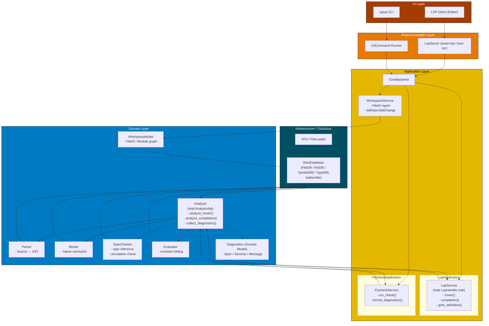

# System Design
## Architecture
アーキテクチャはオニオンアーキテクチャをベースとしています。ドメイン部を型検査に関するものとしている。

詳細は[ARCHITECTURE](/docs/ARCHITECTURE.md)を参照

## シンボルの解決
goto_definitionやreferences, hoverなどで行なう
uriとカーソル位置から該当するシンボルの情報を参照する

基本的な考えはシンプルで、参照したシンボルがそのファイル内で定義されていればそのファイルのASTと型検査結果などを渡せば良い

1. goto_definition(uri, position)
2. uriからASTを得てpositionに相当するシンボルを取得
3. シンボルの種類を判定する
    - Local: ファイル内でのローカル変数, ローカル関数定義
        - Annotation: アノテーションの型定義, クラス定義
    - Global: グローバル変数, グローバル関数定義
        - 他ファイルでのグローバル定義
            - 標準ライブラリでの定義

    ファイル内でlocal宣言されずに使われていればGlobal候補
    local宣言のうちrequireであればrequire参照先のuriを取得してASTの解析をする
4. requireの解決
    config.runtime.pathに含まれるpathパターンをモジュールとして取り込む
    これはLsp起動時のワークスペースルート下のモジュールを取り込む
5. 

# Roadmap
設計検証や実装負荷のバランスから段階的な実装を考える.

将来的にはLuaLSを超える大規模・高速な型検査機を目指すが様々な要素があるため以下のような段階的な実装で着手していく。

| Step  | 対応規模          | 初期化時間  | 更新時間    | メモリ使用量(VSZ, RSS) | コメント |
| ----- | ----------------: | -----       | ----        | -------                | -----    |
| 1     | -300 files        | 500 ms 以下 | 100 ms 以下 | 300 MB 以下            | 中規模   |
| 2     | -1000 files       | 500 ms 以下 | 100 ms 以下 | 1000 MB 以下           | 大規模   |

| Component     | Step1                                    | Step2                                    | Comment              |
| ----------    | --------                                 | --------                                 | -------              |
| Workspace     | VFS                                      | VFS                                      |                      |
| Parser        | AST + Location + Annotation              | **Red-Green Tree**                       | using rowan on spte2 |
| Binder        | TypeEnv + CFG                            | TypeEnv + CFG                            |                      |
| TypeEvaluator | Eval expression and symbol and narrowing | Eval expression and symbol and narrowing |                      |
| TypeCheck     | Naive TypeCheck                          | **Incremental Parsing**                  | using salsa on step2 |

## Comparison lua-language-server
- Target: [Github - lua-language-server](https://github.com/LuaLS/lua-language-server)
- File: 244
- Lines: 56352

| Metric          | lua-ls    | typua   |
| ------          | --------  | ------- |
| Initilize as LS | not yet   | not yet |
| Update as LS    | not yet   | not yet |
| VSZ as LS       | 785.1 MB  | not yet |
| RSS as LS       | 494.1 MB  | not yet |
| Check as CLI    | 9651 msec | not yet |
| VSZ as CLI      | not yet   | not yet |
| RSS as CLI      | not yet   | not yet |

- Target: [Github - telescope.nvim](https://github.com/nvim-telescope/telescope.nvim)
- File: 72
- Lines: 22337

| Metric          | lua-ls    | typua   |
| ------          | --------  | ------- |
| Initilize as LS | not yet   | not yet |
| Update as LS    | not yet   | not yet |
| VSZ as LS       | 634.0 MB  | not yet |
| RSS as LS       | 345.3 MB  | not yet |
| Check as CLI    | 2596 msec | not yet |
| VSZ as CLI      | not yet   | not yet |
| RSS as CLI      | not yet   | not yet |

- Target: [Github - ZeroBraneStudio](https://github.com/pkulchenko/ZeroBraneStudio)
- File: 325
- Lines: 103992

| Metric          | lua-ls   | typua   |
| ------          | -------- | ------- |
| Initilize as LS | no yet   | not yet |
| Update as LS    | MB       | not yet |
| VSZ as LS       | 5.3 GB   | not yet |
| RSS as LS       | 5.1 GB   | not yet |
| Check as CLI    | 10 min   | not yet |
| VSZ as CLI      | 9.9 GB   | not yet |
| RSS as CLI      | 9.9 GB   | not yet |

## About Metrics
### Memory Usage
- VSZ: 
プロセスの仮想メモリ使用量

- RSS: 物理メモリ使用量

これらはpidstatコマンドで使用量を検証出来る

> References  
> [プロセスのVSZ,RSSとfree,meminfoの関係を実機で確認する](https://nopipi.hatenablog.com/entry/2017/11/11/213214)
> [VSZ, RSS(anonymous, file)の理解を深める](https://christina04.hatenablog.com/entry/understand-memory)

