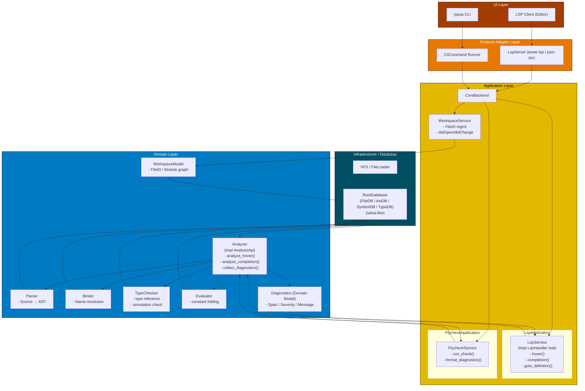

# System Design
## Architecture
アーキテクチャはオニオンアーキテクチャをベースとしています。ドメイン部を型検査に関するものとしている。

詳細は[ARCHITECTURE](/docs/ARCHITECTURE.md)を参照

## シンボルの解決
goto_definitionやreferences, hoverなどで行なう
uriとカーソル位置から該当するシンボルの情報を参照する

基本的な考えはシンプルで、参照したシンボルがそのファイル内で定義されていればそのファイルのASTと型検査結果などを渡せば良い

1. goto_definition(uri, position)
2. uriからASTを得てpositionに相当するシンボルを取得
3. シンボルの種類を判定する
    - Local: ファイル内でのローカル変数, ローカル関数定義
        - Annotation: アノテーションの型定義, クラス定義
    - Global: グローバル変数, グローバル関数定義
        - 他ファイルでのグローバル定義
            - 標準ライブラリでの定義

    ファイル内でlocal宣言されずに使われていればGlobal候補
    local宣言のうちrequireであればrequire参照先のuriを取得してASTの解析をする
4. requireの解決
    config.runtime.pathに含まれるpathパターンをモジュールとして取り込む
    これはLsp起動時のワークスペースルート下のモジュールを取り込む
5. 

# Roadmap
設計検証や実装負荷のバランスから段階的な実装を考える.

将来的にはLuaLSを超える大規模・高速な型検査機を目指すが様々な要素があるため以下のような段階的な実装で着手していく。

| Step  | 対応規模          | 初期化時間  | 更新時間    | メモリ使用量(VSZ, RSS) | コメント |
| ----- | ----------------: | -----       | ----        | -------                | -----    |
| 1     | -300 files        | 500 ms 以下 | 100 ms 以下 | 300 MB 以下            | 中規模   |
| 2     | -1000 files       | 500 ms 以下 | 100 ms 以下 | 1000 MB 以下           | 大規模   |

| Component     | Step1                                    | Step2                                    | Comment              |
| ----------    | --------                                 | --------                                 | -------              |
| Workspace     | VFS                                      | VFS                                      |                      |
| Parser        | AST + Location + Annotation              | **Red-Green Tree**                       | using rowan on spte2 |
| Binder        | TypeEnv + CFG                            | TypeEnv + CFG                            |                      |
| TypeEvaluator | Eval expression and symbol and narrowing | Eval expression and symbol and narrowing |                      |
| TypeCheck     | Naive TypeCheck                          | **Incremental Parsing**                  | using salsa on step2 |

## Comparison lua-language-server
- Target: [Github - lua-language-server](https://github.com/LuaLS/lua-language-server)
- File: 244
- Lines: 56352

| Metric          | lua-ls    | typua   |
| ------          | --------  | ------- |
| Initilize as LS | not yet   | not yet |
| Update as LS    | not yet   | not yet |
| VSZ as LS       | 785.1 MB  | not yet |
| RSS as LS       | 494.1 MB  | not yet |
| Check as CLI    | 9651 msec | not yet |
| VSZ as CLI      | not yet   | not yet |
| RSS as CLI      | not yet   | not yet |

- Target: [Github - telescope.nvim](https://github.com/nvim-telescope/telescope.nvim)
- File: 72
- Lines: 22337

| Metric          | lua-ls    | typua   |
| ------          | --------  | ------- |
| Initilize as LS | not yet   | not yet |
| Update as LS    | not yet   | not yet |
| VSZ as LS       | 634.0 MB  | not yet |
| RSS as LS       | 345.3 MB  | not yet |
| Check as CLI    | 2596 msec | not yet |
| VSZ as CLI      | not yet   | not yet |
| RSS as CLI      | not yet   | not yet |

- Target: [Github - ZeroBraneStudio](https://github.com/pkulchenko/ZeroBraneStudio)
- File: 325
- Lines: 103992

| Metric          | lua-ls   | typua   |
| ------          | -------- | ------- |
| Initilize as LS | no yet   | not yet |
| Update as LS    | MB       | not yet |
| VSZ as LS       | 5.3 GB   | not yet |
| RSS as LS       | 5.1 GB   | not yet |
| Check as CLI    | 10 min   | not yet |
| VSZ as CLI      | 9.9 GB   | not yet |
| RSS as CLI      | 9.9 GB   | not yet |

## About Metrics
### Memory Usage
- VSZ: 
プロセスの仮想メモリ使用量

- RSS: 物理メモリ使用量

これらはpidstatコマンドで使用量を検証出来る

> References  
> [プロセスのVSZ,RSSとfree,meminfoの関係を実機で確認する](https://nopipi.hatenablog.com/entry/2017/11/11/213214)
> [VSZ, RSS(anonymous, file)の理解を深める](https://christina04.hatenablog.com/entry/understand-memory)

# salsa導入
• 概要

  - すでに crates/analyzer/src/db.rs の RootDatabase が #[salsa::db] ＋ impl salsa::Database を持っており、入口と
    しての器は用意済みです。
  - 一方で、実際の解析パイプラインは Analyzer::analyze（crates/analyzer/src/lib.rs:24）が parse → Binder → Checker
    を素直に呼び出しているだけで、salsa の「クエリグラフ」にはまだ載っていません。
  - 「既存コードをできるだけ変えない」方針だと、parser/binder/checker クレートには手を入れず、analyzer クレートの
    内部だけで salsa を完結させるのが筋が良いです。

  ———

  計画（高レベル）

  - ステップ1：既存パイプラインをそのまま1つの「層」とみなし、境界（入力・出力）だけを抽出する。
  - ステップ2：analyzer クレート内に「薄い salsa クエリ層」を追加し、既存関数をラップする形でクエリ定義を行う。
  - ステップ3：Analyzer::analyze からはクエリを叩くだけにし、シグネチャや戻り値は変えない。
  - ステップ4：必要に応じて段階的に「入力の salsa 化」「LSP からの再利用」といった発展段階を踏む。

  ———

  実行ログ（要約：設計の前提整理）

  - CLI のエントリポイント crates/cli/src/main.rs は Analyzer::new() → analyzer.analyze(..) を直接呼び出していま
    す。外部 API としてはこのインターフェイスを壊したくない。
  - 解析パイプラインは概ね次のような1本の流れです（型は既存のもの）：
      - 入力：&str content（＋LuaVersion）
      - parse（crates/parser/src/parser.rs） → AST ＋ 診断
      - Binder（crates/binder/src/binder.rs） → TypeEnv
      - Checker（crates/checker/src/checker.rs） → CheckResult（type_infos, diagnostics）
  - analyzer クレートには Files（crates/analyzer/src/files.rs）と RootDatabase があり、ファイルテキストと解析結果
    を結びつけるハブとしてここに salsa を閉じ込めるのが自然です。

  ———

  結果：既存コードをほぼ変えずに salsa を導入する方針

  1. 責務の切り出し方（何をクエリにするか）
      - まずは「すでにある処理」をそのままクエリにラップするだけに留めると、他クレートへの変更が不要になります。
      - 典型的には analyzer クレートに以下の3〜4レベルのクエリを定義します：
          - file_text(FileId) -> Arc<str>
              - 実装は今ある Files を読むだけにし、最初は単に DashMap<FileId, FileText> のラッパーにする。
          - parse_query(FileId, LuaVersion) -> Parsed
              - 内部で既存の parse を呼ぶ。Parsed は AST＋診断をまとめた新しめの小さな構造体（もしくは既存の型
                の組）。
          - bind_query(FileId, LuaVersion) -> TypeEnv
              - parse_query の結果の AST を使って Binder を動かし、TypeEnv を返す。
          - typecheck_query(FileId, LuaVersion) -> CheckResult
              - bind_query と AST を使って Checker::new(env).typecheck(&ast) をそのまま呼ぶ。
      - 重要なのは、「parser/binder/checker の API には手を入れず、analyzer の新しいモジュール（例：queries.rs）か
        ら既存関数を呼ぶだけにすることです。
  2. RootDatabase の役割を限定する
      - RootDatabase（crates/analyzer/src/db.rs:3）はすでに #[salsa::db] 付きなので、ここに上記クエリ群を登録する
        だけにします。
      - 最初の段階では、以下のような割り切りが「変更を小さく保つ」ために有効です：
          - Files はそのまま保持し、file_text クエリの実体は “self.files から読むだけ” にする。
          - Analyzer 構造体（crates/analyzer/src/lib.rs:19）のフィールド db: RootDatabase は変えず、
            Analyzer::new() もそのまま RootDatabase::default() を使う。
      - こうすると、「salsa を使っているのは analyzer クレートの内部だけ」という状態が保たれます。
  3. Analyzer::analyze の書き換え方針（外部APIを変えない）
      - シグネチャと戻り値 AnalyzeResult はそのままにします：
          - pub fn analyze(&self, uri: &str, content: &str, version: &LuaVersion) -> AnalyzeResult
      - 内部の処理だけを次のように差し替えるイメージです（概念的な流れだけ）：
          - URI（文字列）から内部の FileId を決める（既存か、新規の簡単なマッピング）。
          - Files に FileId -> content を登録（現在の DashMap を利用）。
          - RootDatabase インスタンスに対して typecheck_query(file_id, *version) を呼び、CheckResult を得る。
          - それを現在の AnalyzeResult に変換して返す。
      - これにより、CLI や将来の LSP 側は一切変更せずに、内部実装だけ salsa ベースに差し替えができます。
  4. 段階的な導入レベル

     「既存コードをできるだけ変えない」という観点から、次のような3段階を想定しておくと安全です。
      - レベル0：今のまま（salsa は RootDatabase 定義にとどまる状態）
      - レベル1（最小導入）：
          - クエリを analyzer クレートに追加し、Analyzer::analyze は毎回 新しい RootDatabase を作ってクエリを実行
            する。
          - この段階では「インクリメンタル」な恩恵はほぼありませんが、設計・責務分割の練習段階として有効。
          - 他クレートは一切変更不要。
      - レベル2（インクリメンタル化の開始）：
          - Analyzer が長寿命な RootDatabase を保持し続け、複数ファイル・複数回の analyze 呼び出し間でクエリ結果を
            再利用する。
          - Files の更新（URI→FileId→テキスト）を Analyzer のメソッドで一元管理。
          - 必要になった時点で、file_text を salsa の #[salsa::input] に昇格させ、Files の役割を薄くしていく。
      - レベル3（高度活用・任意）：
          - binder や checker 自体をクエリグループ化して、より細かい単位で再利用・キャッシュする。
          - これは既存クレートの API に手を入れることになるので、「できるだけ変えない」という要件が弱くなってから
            着手するのが良いです。
  5. 設計上の注意点（既存コードを守るためのガイドライン）
      - 依存方向：
          - parser, binder, checker は salsa を一切知らず、従来通りの関数/構造体だけを提供する。
          - analyzer だけが salsa を依存として持ち、これら3クレートをラップしてクエリにする。
      - 型の再利用：
          - クエリの戻り値には極力既存の型（AST 型、TypeEnv, CheckResult 等）を使う。
          - 新しい型（Parsed など）を導入する場合も、あくまで複数の既存型を束ねる薄いコンテナに留める。
      - エラーハンドリング：
          - いきなりクエリを細かく刻まず、現在の parse → Binder → Checker の「1リクエスト内完結」を保ったままクエ
            リ化する方が、挙動の差分が小さくデバッグしやすいです。

  ———

  次のアクション

  - 設計フェーズとしては、まず以下を紙に（またはドキュメントに）落としてみるのがおすすめです：
      - クエリの一覧と、各クエリが依存する下位クエリ・既存関数の対応表（file_text → parse_query → bind_query
        → typecheck_query）。
      - Analyzer が外部に見せる API と、内部で利用する FileId/LuaVersion/クエリとのマッピング図。
  - その上で、もしよければ「レベル1」導入（毎回新しい DB を作る最小版）から実装案を一緒に具体化していけます。
      - その際は「クエリ trait の名前」「モジュール構成案」「どこまでを salsa の input にするか」などを詳細に詰め
        ていきましょう。
