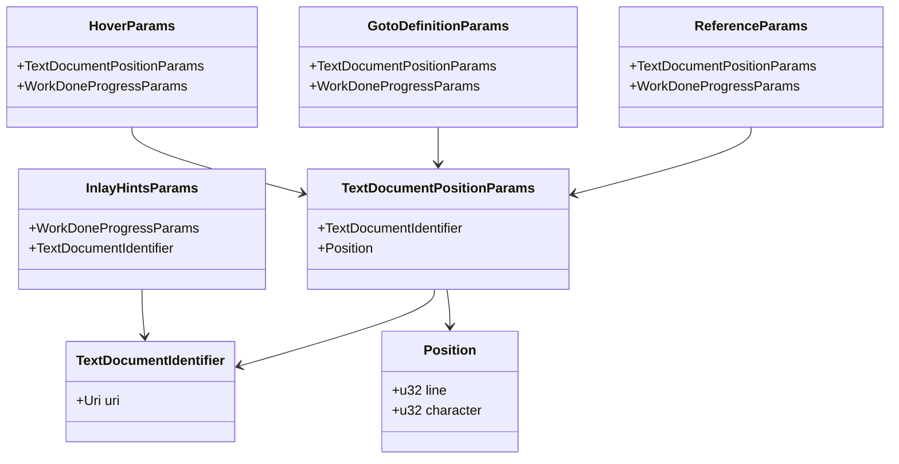

# Lsp types

```mermaid
classDiagram
    class HoverParams {
        +TextDocumentPositionParams
        +WorkDoneProgressParams
    }
    class GotoDefinitionParams {
        +TextDocumentPositionParams
        +WorkDoneProgressParams
    }
    class ReferenceParams {
        +TextDocumentPositionParams
        +WorkDoneProgressParams
    }
    class InlayHintsParams {
        +WorkDoneProgressParams
        +TextDocumentIdentifier
    }
    class TextDocumentPositionParams {
        +TextDocumentIdentifier
        +Position
    }
    class Position {
        +u32 line
        +u32 character
    }
    class TextDocumentIdentifier {
        +Uri uri
    }
    HoverParams --> TextDocumentPositionParams
    GotoDefinitionParams --> TextDocumentPositionParams
    ReferenceParams --> TextDocumentPositionParams
    InlayHintsParams --> TextDocumentIdentifier
    TextDocumentPositionParams --> TextDocumentIdentifier
    TextDocumentPositionParams --> Position
```

# Data Flow
## Hover
1. 位置
2. ノード特定
3. 型推論
4. 定義探索

```lua:types.lua
---@class Point2d
---@field x number
---@field y number
```


```lua:main.lua
---@type Point2d
         ^hover-request
local p = {}
```
