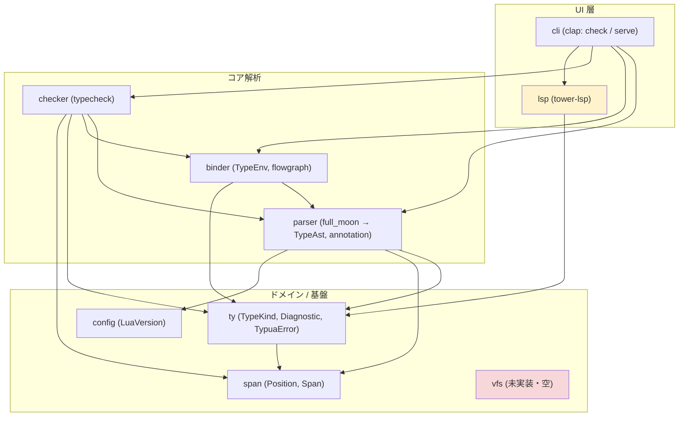

# System Design

> このドキュメントは **コードを正** として記述する。
> README やその他ドキュメントと食い違う場合は本書とコードを優先する。
> 「計画」と明記した項目以外は、現行コードに実在する構造を表す。

## 1. 設計目標

- LuaLS（lua-language-server）を超える、大規模・高速な Lua 型検査機。
- 対応バージョン: Lua 5.1〜5.4 + LuaJIT（**現状は Lua 5.1 のみ実装**）。
- アノテーション構文は LuaCATS（lua-language-server）互換を目指す。
- CLI（一括チェック）と LSP（エディタ連携）の2フロントエンドを、共通のコア解析基盤に載せる。

## 2. クレート構成（現行・コード基準）

ワークスペースは9クレート。オニオンアーキテクチャを志向し、`ty` をドメイン核に据える。


```mermaid
graph TB
    subgraph UI["UI 層"]
        CLI["cli (clap: check / serve)"]
        LSP["lsp (tower-lsp)"]
    end
    subgraph CORE["コア解析"]
        PARSER["parser (full_moon → TypeAst, annotation)"]
        BINDER["binder (TypeEnv, flowgraph)"]
        CHECKER["checker (typecheck)"]
    end
    subgraph DOMAIN["ドメイン / 基盤"]
        TY["ty (TypeKind, Diagnostic, TypuaError)"]
        SPAN["span (Position, Span)"]
        CONFIG["config (LuaVersion)"]
        VFS["vfs (未実装・空)"]
    end

    CLI --> PARSER
    CLI --> BINDER
    CLI --> CHECKER
    CLI --> LSP
    LSP --> TY
    PARSER --> TY
    PARSER --> SPAN
    PARSER --> CONFIG
    BINDER --> PARSER
    BINDER --> TY
    CHECKER --> PARSER
    CHECKER --> BINDER
    CHECKER --> TY
    CHECKER --> SPAN
    TY --> SPAN

    style VFS fill:#f8d7da
    style LSP fill:#fff3cd
```

### 依存の原則

- `ty` がドメイン核。`span` 以外に依存しない。
- 下位（span/config/ty）から上位（parser→binder→checker）への一方向依存を維持する。
- **full_moon は parser クレートに封じ込める**（後述 6.1。現状 `span` に漏れており、これは是正対象）。

## 3. レイヤーの責務と現状到達点

| レイヤー | 責務 | 現状（実装済み） | 未実装（`unimplemented!()` 含む） |
| --- | --- | --- | --- |
| **span** | 位置情報 | Position / Span | full_moon 依存の除去（6.1） |
| **config** | 設定 | `LuaVersion`（Lua51） | Lua52/53/54/JIT、`.typua.toml` 読込 |
| **ty** | 型・診断・エラー | `TypeKind` 列挙、Display、`TypuaError` 系、`Diagnostic` | `subtype`/`can_add` はプリミティブのみ。Union/関数/テーブル等は未対応 |
| **parser** | Lua→IR、注釈解析 | LocalAssign、式(Number/String/Boolean/BinOp/UnOp/Var)、`---@type` | Assignment/If/関数/for 等。`@class`他の注釈 |
| **binder** | 型環境・CFG 構築 | LocalAssign の `@type` 束縛、注釈無しは `Any` | CFG（flowgraph は空）、スコープ管理 |
| **checker** | 型検査 | LocalAssign の assign-type-mismatch、`eval_expr`(Number/Boolean/Var/BinOp の Add) | narrowing、関数/テーブル/Union 比較、Add 以外の演算 |
| **lsp** | LSP サーバ | initialize/shutdown/did_open/did_close + ログ | コア解析との接続、did_change、診断配信、document 保持 |
| **vfs** | 仮想ファイルシステム | （空） | ファイル収集・ワークスペース管理 |
| **cli** | エントリ | `check`(単一ファイル) / `serve`(LSP 起動) | ワークスペース走査、診断整形出力 |

## 4. 型検査パイプライン

現行の垂直スライスは `cli check` 内に直結している。

```
source (1 file)
  → parser::parse(code, LuaVersion) -> (TypeAst, Vec<TypuaError>)
  → Binder::bind(&TypeAst)          -> TypeEnv
  → checker::typecheck(&TypeAst, &env) -> CheckResult { diagnostics }
```

- **Parser**: full_moon でパースし、独自 IR `TypeAst` へ変換（`From<full_moon::ast::*>`）。注釈は leading trivia を nom で解析。
- **Binder**: `TypeAst` を走査し、変数→型の束縛（`TypeEnv`）を作る。注釈があればその型、無ければ `Any`。
- **Checker**: 式を評価して型を求め（`eval_expr`）、注釈型との部分型関係を `TypeKind::subtype` で検査して `Diagnostic` を生成。

> 動作する範囲は「プリミティブのローカル代入」と「number + number」のみ。
> その他の構文を与えると `unimplemented!()` で panic する（4 章の方針参照）。

## 5. データ表現

- IR: `parser::ast::TypeAst`（Block / Stmt / Expression）。downstream はこの IR のみを参照し、full_moon を直接触らない。
- 型: `ty::TypeKind`（Unknown=top / Never=bottom / Any / プリミティブ / Function / Class / Generic / Union / Array / Dict / KVTable）。
- 型環境: `binder::TypeEnv`。現状は **スコープを持たないフラットな map**。永続データ構造（`im::HashMap`）を使用しているが、採用是非は要相談（7.1）。
- 診断: `ty::Diagnostic { message, kind, span }`、`DiagnosticKind`（TypeMismatch / NotDeclaredVariable）。

## 6. 設計境界の方針

### 6.1 パーサー差し替え可能性（full_moon → rowan 計画）

IR `TypeAst` を seam として、具象パーサ（full_moon）を交換可能にする。理想は「`TypeAst::from(...)` を書き換えるだけ」。

- 現状の漏れ: `span` クレートが `From<full_moon::tokenizer::*>` を実装している。また `ty/Cargo.toml` が full_moon を未使用依存として持つ。
- 是正方針: full_moon を **parser クレート内に限定**する。span は純粋な位置型に戻し、full_moon→span 変換は parser 側のローカルヘルパへ移す。`ty` の不要依存は削除。
- これにより rowan 移行は parser クレートに閉じる。

### 6.2 解析サービス層の新設（計画）

現状 LSP はコア（parser/binder/checker）に依存しておらず、解析ロジックが `cli/main.rs` にベタ書きされている。CLI と LSP が同じ解析を共有できるよう、**解析オーケストレーション層**（例: `analyze` crate、あるいは checker 上のファサード）を新設し、両フロントエンドからこれを呼ぶ。

### 6.3 未実装ノードの扱い（開発方針）

- **`unimplemented!()` は意図的な未実装マーカーとして維持する。** 機能を実装するたびに対応する `unimplemented!()` を解除していく。
- 早期開発段階では、未対応構文に対して panic することを許容する（Step1）。
- LSP 常駐時の耐障害性（未対応ノードをスキップして部分結果を返す）は将来の検討事項とし、本方針を置き換えるかどうかは別途判断する。

## 7. 未確定の設計論点

### 7.1 永続データ構造（im）と増分計算（salsa）— 要相談

- レイテンシ・メモリ効率・メモリリークに直結するため、採用可否を別途検討する。
- 現状 `im::HashMap` を `TypeEnv` で使用中だが、これを継続するかは未確定。
- salsa は未導入。Step2 の増分計算で導入を検討する。

### 7.2 採用が決まっているもの

- **rayon**: 複数ファイルの並列型検査に採用。
- **rowan**: Step2 の Red-Green Tree 化に採用（6.1 の seam 経由で full_moon を差し替え）。

## 8. ロードマップ

段階的に実装する。Step1 は素朴に動かし、Step2 で増分化・大規模化する。

| Component | Step1 | Step2 | Comment |
| --------- | ----- | ----- | ------- |
| Workspace | VFS | VFS | 現状 vfs は空 |
| Parser | AST + Location + Annotation | Red-Green Tree | step2 で rowan |
| Binder | TypeEnv + CFG | TypeEnv + CFG | 現状 CFG 未実装 |
| TypeChecker | Naive TypeCheck | Incremental | step2 で salsa（要相談） |

### 性能目標

| Step | 対応規模 | 初期化時間 | 更新時間 | メモリ(VSZ/RSS) |
| ---- | -------: | ---------- | -------- | --------------- |
| 1 | 〜300 files | 500 ms 以下 | 100 ms 以下 | 300 MB 以下 |
| 2 | 〜1000 files | 500 ms 以下 | 100 ms 以下 | 1000 MB 以下 |

### lua-language-server とのベンチ比較（目標）

計測は pidstat を用いる（VSZ=仮想メモリ, RSS=物理メモリ）。実測値は `docs/BENCHES.md` に記録する。

| Target | File | Lines |
| ------ | ---: | ----: |
| lua-language-server | 244 | 56352 |
| telescope.nvim | 72 | 22337 |
| ZeroBraneStudio | 325 | 103992 |

## 9. 既知の不整合（コードレビュー由来・要修正）

設計レビューで検出した、設計の意図と実装がずれている箇所。

- `binder::TypeEnv::insert` の `Result` が反転している（新規挿入で `Err`、上書きで `Ok`）。呼び出し側が握り潰しているため未表面化。
- `cli/main.rs` がパースエラー（`parse` の第2返り値）を捨てており、構文エラーが報告されない。
- `parser` の Boolean 式が `false` のみ対応で `true` が未実装。
- `ty/Cargo.toml` の full_moon は未使用依存。
